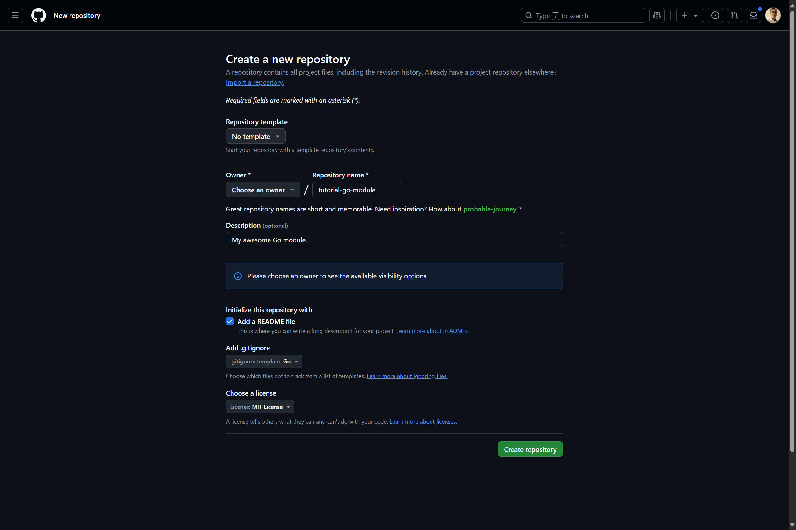
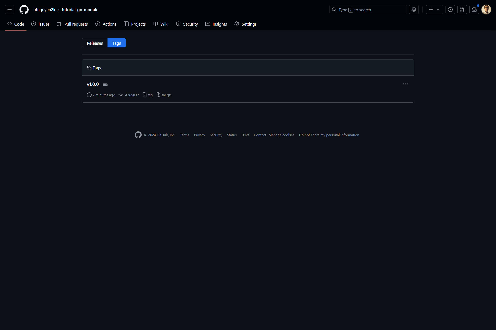

# Giới thiệu

Từ phiên bản 1.11, Go cho phép lập trình viên đóng gói mã nguồn vào các module <sup>[1]</sup>, và sử dụng trong các ứng dụng khác. Điều này giúp quản lý và tái sử dụng mã nguồn một cách hiệu quả hơn. Bài viết này tóm tắt cách tạo 1 module Go và chia sẻ nó trong các ứng dụng khác.

```bs-alert info

Bài viết này giả định bạn đã làm quen và phát triển dự án với Go một thời gian; đồng thời biết cách sử dụng git và GitHub.
```

```bs-alert info

Môi trường minh hoạ được sử dụng trong bài viết này là Ubuntu Linux. Nhưng phần lớn các câu lệnh trong bài viết này là của Go và git, vẫn có thể áp dụng được trên các hệ điều hành khác như Windows và macOS.
```

### Chọn nơi lưu trữ module

Bạn bắt đầu sử dụng 1 module bằng cách "import" module ở đầu file Go. Ví dụ: `import "github.com/btnguyen2k/goyai"`. Nếu để ý, bạn sẽ thấy khá nhiều module có tên dạng 1 địa chỉ website, và bắt đầu bằng `github.com`. Và nếu truy cập vào địa chỉ đó, bạn sẽ đến được trang mã nguồn của module trên GitHub!

Nếu bạn đang nghĩ rằng "Ồ, GitHub là nơi lưu trữ Go module" thì bạn đã nghĩ đúng rồi đấy. Thực tế, Go hỗ trợ module lưu trên Git, Subversion, Mercurial, Bazaar, and Fossil server <sup>[2]</sup>. Và vì GitHub là 1 trong những dịch vụ git server phổ biến nhất của các dự án mã nguồn mỡ, nên khá nhiều Go module mã nguồn mở "chọn mặt gởi...mã nguồn" với GitHub.

Trong bài viết này, chúng ta sẽ tạo 1 module Go và lưu trữ nó trên GitHub.

```bs-alert secondary

[1] Tham chiếu: https://go.dev/doc/go1.11#modules

[2] Tham chiếu: 
- https://go.dev/doc/modules/managing-source
- https://go.dev/blog/publishing-go-modules
```

### Tạo 1 repository trên GitHub

Đầu tiên, bạn cần tạo 1 repository trên GitHub. Thao khảo tài liệu của GitHub về cách tạo 1 repository mới ở [đây](https://docs.github.com/en/repositories/creating-and-managing-repositories/creating-a-new-repository). Nếu bạn tạo GitHub repository qua giao diện web của GitHub, bạn có thể chọn thêm các tham số để GitHub tự động tạo cho bạn các file `README`, `.gitignore` và `LICENSE` như hình minh họa bên dưới:



### Khởi tạo module

Sau khi repository đã được tạo, hãy clone repository về máy tính của bạn, chuyển vào thư mục repository và khởi tạo module bằng lệnh `go mod init`:

```bash
$ git clone https://github.com/btnguyen2k/tutorial-go-module
Cloning into 'tutorial-go-module'...
remote: Enumerating objects: 5, done.
remote: Counting objects: 100% (5/5), done.
remote: Compressing objects: 100% (4/4), done.
remote: Total 5 (delta 0), reused 0 (delta 0), pack-reused 0 (from 0)
Receiving objects: 100% (5/5), done.

$ cd tutorial-go-module/

$ go mod init github.com/btnguyen2k/tutorial-go-module
go: creating new go.mod: module github.com/btnguyen2k/tutorial-go-module
```

```bs-alert secondary

Thay `github.com/btnguyen2k/tutorial-go-module` bằng đường dẫn tới repository của bạn trên GitHub.
```

Sau khi chạy các lệnh thành công, bạn sẽ có 1 thư mục với các file tương tự như sau:

```bash
$ tree -a -L 1
.
├── .git
├── .gitignore
├── LICENSE
├── README.md
└── go.mod
```

File `go.mod` được tạo ra bởi lệnh `go mod init`, chứa các thông tin về module. Các thư mục và file còn lại (`.git`, `.gitignore`, `LICENSE`, `README.md`) có được khi bạn clone repository từ GitHub.

Nội dung file `go.mod` sẽ tương tự như sau:

```go
module github.com/btnguyen2k/tutorial-go-module

go 1.21.4
```

Dòng đầu tiên chính là tên module bạn vừa khởi tạo, với đầy đủ đường dẫn trỏ tới repository trên GitHub. Dòng `go 1.21.4` là phiên bản Go mà module này sử dụng, mặc định là phiên bản Go mà trên máy bạn sử dụng khi chạy lệnh `go mod init`.

Để module của bạn có tính tương thích cao nhất với các ứng dụng và module khác, bạn có thể hạ phiên bản Go trong file `go.mod` xuống. Để minh hoạ, bài biết này sử dụng phiên bản 1.13 của Go. File `go.mod` sẽ có nội dung như sau:

```go
module github.com/btnguyen2k/tutorial-go-module

go 1.13
```

```bs-alert secondary

Bạn có thể commit và push các thay đổi vừa rồi lên GitHub trước khi đi tiếp.
```

### Phát triển tính năng cho module

Sau khi module đã được khởi tạo, bạn có thể bắt đầu phát triển tính năng cho module. Để minh hoạ, bài viết này sẽ tạo 1 hàm tính giá trị MD5 của 1 chuỗi và lưu trong file `module.go`:

```go
package mylib

import (
    "crypto/md5"
    "encoding/hex"
)

// Md5String calculates MD5 hash of a string
func Md5String(s string) string {
    h := md5.New()
    h.Write([]byte(s))
    return hex.EncodeToString(h.Sum(nil))
}
```

Một module tốt thì nên có unit test. Hãy tạo 1 thư mục con tên `module_test` để chứa các test case cho module:

```bash
$ mkdir module_test

$ cd module_test/

$ go mod init module_test
go: creating new go.mod: module module_test
```

```bs-alert secondary

Bạn có thể để unit test cùng thư mục/package với code chính của module. Như vậy bạn có thể test được các hàm private của module. Tuy nhiên, khuyến nghị bạn để các test trong 1 thư mục/package riêng để test như là 1 người bên ngoài sử dụng module của bạn.
```

Tạo file `module_test.go` trong thư mục `module_test` với nội dung sau:

```go
package module_test

import (
    "testing"

    mylib "github.com/btnguyen2k/tutorial-go-module"
)

func TestMd5String(t *testing.T) {
    s := "Goc Lap Trinh"
    expected := "696c82bb924cac3bf3006a08704fc0cd"
    if actual := mylib.Md5String(s); actual != expected {
        t.Errorf("expected [%v] but got [%v]", expected, actual)
    }
}
```

Trước khi chạy test, hãy mở file `go.mod` ở thư mục `module_test` ra. Hiện tại nội dung nó sẽ tương tự như thế này:

```go
module module_test

go 1.21.4
```

Hãy sửa lại nội dung file `go.mod` như sau:

```go
module module_test

go 1.21.4

replace github.com/btnguyen2k/tutorial-go-module => ../
```

```bs-alert secondary

Lưu ý: Thay `github.com/btnguyen2k/tutorial-go-module` bằng đường dẫn tới repository của bạn trên GitHub.
```

Lưu nội dung file `go.mod` và chạy lệnh `go mod tidy` ở thư mục `module_test`:

```bash
$ go mod tidy
go: found github.com/btnguyen2k/tutorial-go-module in github.com/btnguyen2k/tutorial-go-module v0.0.0-00010101000000-000000000000
```

Nội dung file `go.mod` sẽ trở thành như sau:

```go
module module_test

go 1.21.4

replace github.com/btnguyen2k/tutorial-go-module => ../

require github.com/btnguyen2k/tutorial-go-module v0.0.0-00010101000000-000000000000
```

Bây giờ bạn có thể chạy test, ở trong thư mục `module_test`:

```bash
$ go test
PASS
ok      module_test     0.002s
```

Hoặc chạy test từ thư mục gốc của repository:

```bash
$ cd module_test/ && go test && cd ..
PASS
ok      module_test     0.003s
```

```bs-alert secondary

Bạn có thể commit và push các thay đổi vừa rồi lên GitHub trước khi đi tiếp.
```

### Đánh version và publish module

Khi tính năng của module đã hoàn thiện, bước cuối cùng để chia sẻ module của bạn với với cộng đồng là đánh version và publish module. Nếu module của bạn lưu trữ trên git server, ta dùng lệnh `git tag` để đánh version và publish module. Ví dụ, để đánh version `1.0.0` cho module, ta chạy các lệnh sau ở thư mục gốc của repository:

```bs-alert secondary

Lưu ý: Nhớ chạy các test để đảm bảo module hoạt động đúng, và commit đầy đủ các file cần thiết trước khi đánh version và publish module.
```

```bash
$ git tag v1.0.0

$ git push origin v1.0.0
Total 0 (delta 0), reused 0 (delta 0), pack-reused 0
To https://github.com/btnguyen2k/tutorial-go-module
 * [new tag]         v1.0.0 -> v1.0.0
```

Tag `v1.0.0` sẽ xuất hiện trên GitHub repository của bạn, tương tự như sau:



# Lời kết

Chúng ta đã cùng nhau đi qua các bước cơ bản để tạo 1 module Go, viết unit test cho module, và đánh version module và chia sẻ nó trên GitHub. Hy vọng bài viết này giúp ích cho bạn trong việc phát triển và chia sẻ module Go của riêng mình.

Các tài liệu tham khảo thêm:

- Tài liệu "chính chủ" của Go về cách tạo, chia sẻ và phát triên module: https://go.dev/blog/using-go-modules
- Khuyến nghị đánh version cho module theo [Semantic Versioning](https://semver.org/)
- Bạn có thể tạo 1 cấu trúc module rỗng để sau này khi cần tạo module mới thì "clone" ra sử dụng. Hoặc bạn có thể sử dụng "hàng" có sẵn: https://github.com/btnguyen2k/go-module-template

<hr>

_[[do-tag ghissue_comment]]_
