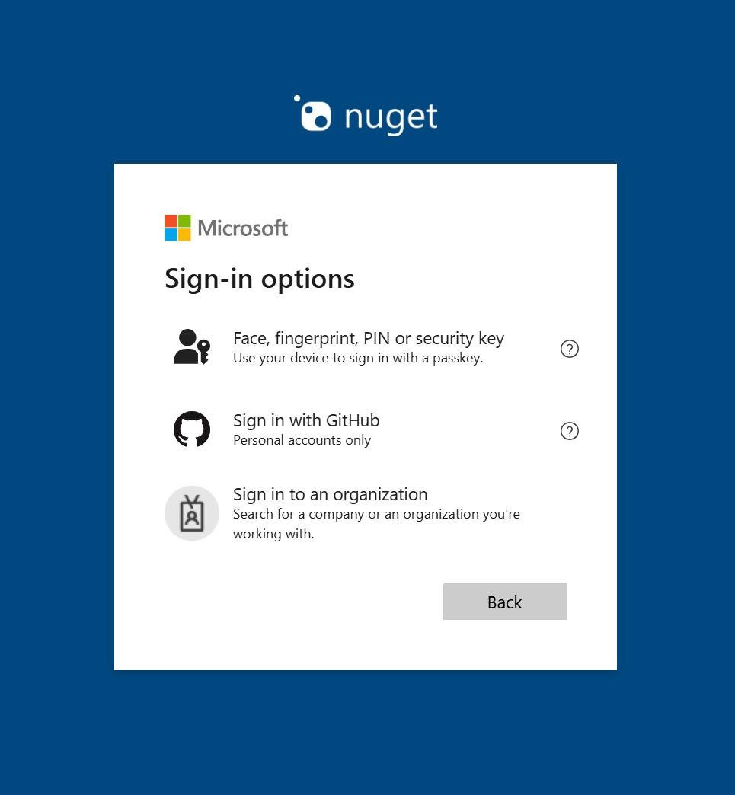
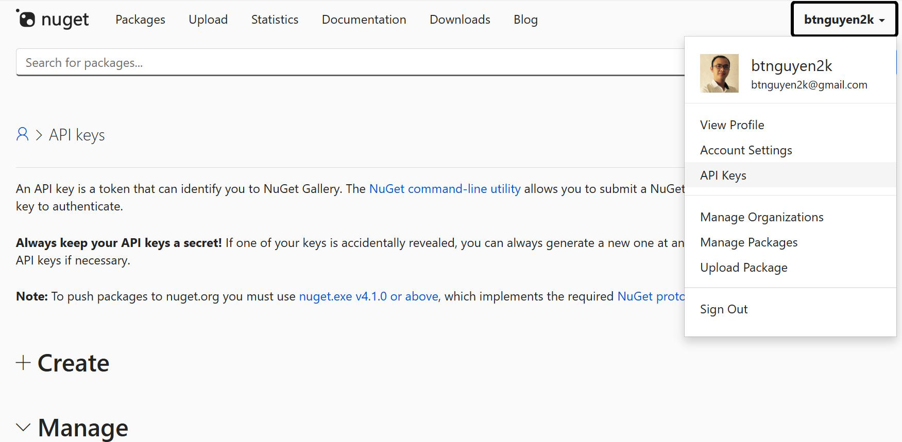
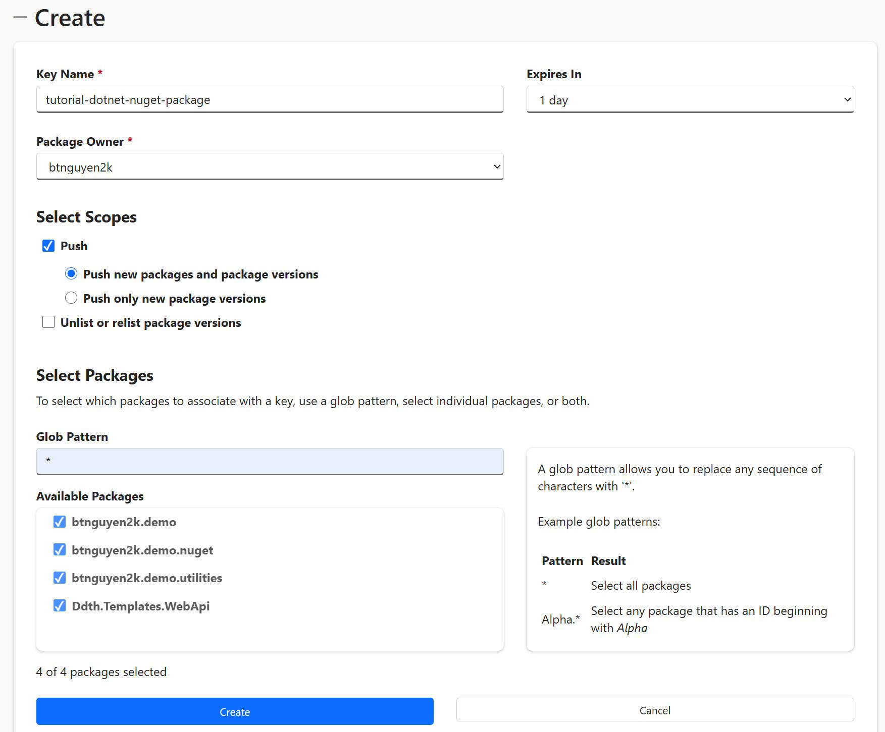
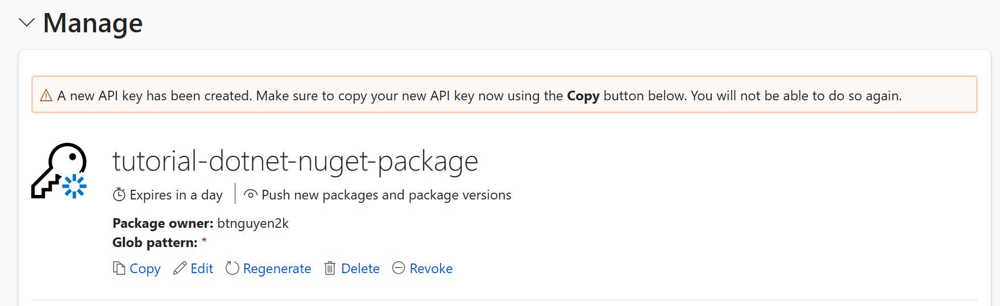
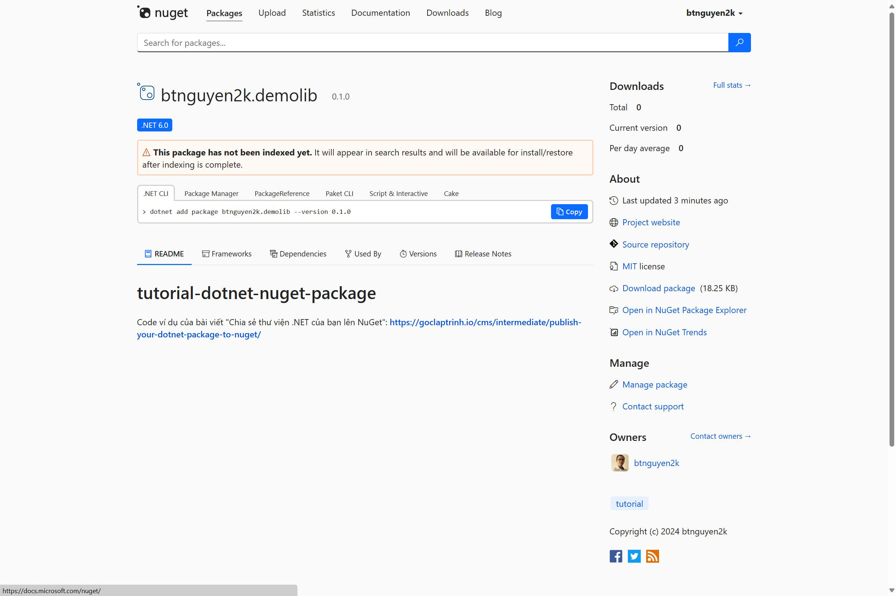

# NuGet/NuGet Gallery/NuGet.org là gì?

**NuGet** là 1 công cụ package manager cho .NET giúp lập trình viên quản lý các thư viện trong dự án của mình. **NuGet Gallery** là kho lưu trữ tập trung các package để lập trình viên download và sử dụng. NuGet.org là 1 NuGet Gallery công cộng được quản lý bởi Microsoft. Các lập trình viên .NET có thể chia sẻ các package của mình lên NuGet.org mà không cần phải lo lắng về việc dựng và quản lý 1 NuGet server của riêng mình. <sup>[[1]](https://learn.microsoft.com/en-us/nuget/what-is-nuget)</sup>

```bs-alert secondary

[1] Tham khảo thêm thông tin về NuGet ở trang tài liệu chính thức của Microsoft ở địa chỉ https://learn.microsoft.com/en-us/nuget/what-is-nuget
```

Bài viết này tóm tắt các bước hướng dẫn bạn tạo 1 .NET package và chia sẻ lên NuGet.org.

```bs-alert info

Bài viết giả định bạn đã làm quen và phát triển dự án với .NET một thời gian. Các hướng dẫn trong bài viết áp dụng cho NuGet.org, nhưng cũng có thể áp dụng để publish package của bạn lên 1 private NuGet server.
```

```bs-alert info

Môi trường minh hoạ được sử dụng trong bài viết này là Ubuntu Linux. Nhưng phần lớn các câu lệnh trong bài viết này là [dotnet cli](https://learn.microsoft.com/en-us/dotnet/core/tools/), vẫn có thể áp dụng được trên các hệ điều hành khác như Windows và macOS.
```

# Tạo account trên NuGet.org

Đầu tiên bạn cần phải có 1 account trên NuGet.org - dĩ nhiên rồi :). Bài viết sẽ không đi sâu vào qui trình tạo account trên NuGet.org, chỉ tóm tắt một số ý chính:

- Account trên NuGet.org là miễn phí.
- Bạn cần 1 tài khoản Microsoft để đăng ký account trên NuGet.org.
- Nếu bạn có account GitHub.com, bạn có thể sử dụng nó để đăng ký/login vào NuGet.org.



### Tạo 1 API key

Sau khi đã có account trên NuGet.org, bạn cần tạo 1 API key để có thể publish package lên NuGet.org. Bạn tạo API key trong phần quản lý API key trên NuGet.org:



Đặt tên và cấp các quyền cần thiết cho API key:



Sau khi API key được tạo, bạn copy lại API key để dùng cho sau này. Lưu ý: bạn chỉ có thể làm điều này ngay sau khi tạo API key, sau khi thoát ra khỏi trang này, bạn sẽ không thể xem lại API key đã tạo. Tuy nhiên bạn có thể tạo lại API key bằng cách click vào nút `Regenerate` ở trang quản lý API key:



# Tạo .NET package

Kế tiếp, chúng ta sẽ tạo package .NET của chúng ta: ta sẽ tạo 1 solution .NET và 1 project bên trong. Bạn có thể tạo solution và project từ IDE (ví dụ như Visual Studio) hoặc sử dụng [dotnet cli](https://learn.microsoft.com/en-us/dotnet/core/tools/). Trong bài viết này, chúng ta sẽ sử dụng dotnet cli.

```bash
# Đặt tên cho package, tên này sẽ dùng lại ở vài dòng lệnh sau này
# nên ta gán vào 1 biến để tiện sử dụng
MY_PACKAGE_NAME=btnguyen2k.demolib

# Tạo .NET solution trong thư mục hiện tại
dotnet new sln -n $MY_PACKAGE_NAME

# Tạo 1 dự án bên trong solution
dotnet new classlib -n $MY_PACKAGE_NAME

# Thêm dự án vào solution
dotnet sln add $MY_PACKAGE_NAME/$MY_PACKAGE_NAME.csproj
```

Các câu lệnh trên sẽ tạo 1 .NET solution với tên là `btnguyen2k.demolib` ở thư mục hiện tại và 1 project loại class library cũng với tên là `btnguyen2k.demolib` ở bên trong solution. Sau khi solution và project được tạo thành công, bạn sẽ có được 1 cấu trúc thư mục tương tự như sau:

```terminal
tutorial-dotnet-nuget-package/
├── .git/
├── .gitignore
├── LICENSE.md
├── README.md
├── btnguyen2k.demolib/
│   ├── Class1.cs
│   ├── btnguyen2k.demolib.csproj
├── btnguyen2k.demolib.sln
```

```bs-alert secondary

Bạn có thể tạo trực tiếp project mà không cần tạo solution. Tuy nhiên khuyến khích bạn tạo project con bên trong solution để dễ dàng quản lý khi package của bạn có nhiều tính năng hơn sau này. Ví dụ như thêm project chuyên cho unit test vào solution.
```

```bs-alert secondary

Trừ khi bạn tạo package dùng 1 lần rồi bỏ (chẳng hạn cho mục đích demo, giảng dạy), trong đa số trường hợp package của bạn sẽ chuyên nghiệp hơn nếu có các document đi kèm (ví dụ như README, LICENSE, CHANGELOG, ...). Và thường bạn cũng sẽ sử dụng 1 công cụ quản lý mã nguồn như git để quản lý source code package của bạn. Do vậy, trong hình cây thư mục ở trên bạn thấy có thêm các file/thư mục `.git`, `.gitignore`, `LICENSE.md`, `README.md`, v.v...
```

# Thêm tính năng vào package

Bước này không bắt buộc, nhưng để giả lập qui trình trong thực tế, chúng ta hãy thêm 1 vài tính năng đơn giản vào package. Trong bài viết này ta sẽ đổi tên file `Class1.cs` thành `MyStringExtension.cs` và thêm tính năng tính MD5 hash của 1 string:

```csharp
using System.Security.Cryptography;
using System.Text;

namespace btnguyen2k.demolib;

public static class MyStringExtension
{
    /// <summary>
    /// Calculate MD5 hash of a string
    /// </summary>
    /// <param name="s">input string</param>
    /// <returns>MD5 hash of the input string</returns>
    public static string Md5Hash(this string s)
    {
        using (var md5 = MD5.Create())
        {
            var inputBytes = Encoding.UTF8.GetBytes(s);
            var hashBytes = md5.ComputeHash(inputBytes);
            var sb = new StringBuilder();
            foreach (var b in hashBytes)
            {
                sb.Append(b.ToString("X2"));
            }
            return sb.ToString();
        }
    }
}
```

# Publish package lên NuGet.org

### Cập nhật metadata vào project

Để có thể publish package lên NuGet server, đầu tiên ta cần thêm 1 số metadata vào project để NuGet biết cách publish package của bạn. Hãy mở file project (KHÔNG phải file solution nha) ra, trong bài biết này là file `btnguyen2k.demolib.csproj`, bạn sẽ thấy nội dung nó tương tự như sau:

```xml
<Project Sdk="Microsoft.NET.Sdk">

  <PropertyGroup>
    <TargetFramework>net8.0</TargetFramework>
    <ImplicitUsings>enable</ImplicitUsings>
    <Nullable>enable</Nullable>
  </PropertyGroup>

</Project>
```

Ta sẽ thêm vào các metadata cần thiết để chuyển project thành 1 NuGet package:

```xml
<Project Sdk="Microsoft.NET.Sdk">

  <PropertyGroup>
    <TargetFramework>net8.0</TargetFramework>
    <ImplicitUsings>enable</ImplicitUsings>
    <Nullable>enable</Nullable>
  </PropertyGroup>

  <PropertyGroup>
    <PackageId>btnguyen2k.demolib</PackageId>
    <PackageVersion>0.1.0</PackageVersion>
    <Title>Tutorial: dotNet NuGet package</Title>
    <Authors>btnguyen2k</Authors>
    <Description>Sample code for tutorial to create a .NET package and publish onto NuGet.org</Description>
    <PackageTags>tutorial</PackageTags>
    <PackageProjectUrl>https://github.com/btnguyen2k/tutorial-dotnet-nuget-package</PackageProjectUrl>
    <PackageLicenseExpression>MIT</PackageLicenseExpression>
    <Copyright>Copyright (c) 2024 btnguyen2k</Copyright>
    <PackageReadmeFile>README.md</PackageReadmeFile>
  </PropertyGroup>

  <PropertyGroup>
    <RepositoryUrl>https://github.com/btnguyen2k/tutorial-dotnet-nuget-package</RepositoryUrl>
    <RepositoryType>git</RepositoryType>
  </PropertyGroup>

  <PropertyGroup>
    <PackageReleaseNotes>First release with demo functionality only.</PackageReleaseNotes>
  </PropertyGroup>

  <ItemGroup>
    <None Include="../README.md" Pack="true" PackagePath="" />
    <None Include="../LICENSE.md" Pack="true" PackagePath="" />
  </ItemGroup>

</Project>
```

Dòng `<TargetFramework>net8.0</TargetFramework>` đã có từ đầu khi project được tạo. Dòng này có ý nghĩa rằng project của bạn sử dụng `.NET 8.0`. Với các package dạng thư viện, bạn có thể giảm giá trị này xuống thấp nhất có thể để tăng khả năng tương thích với các dự án khác. Ví dụ như nếu package của bạn không sử dụng các tính năng mới của `.NET 8.0`, bạn có thể giảm giá trị này xuống `net5.0`.

Tóm tắt các metadata được thêm vào:

| Metadata  | Ý nghĩa                                                                                                                                                                               |
|-----------|---------------------------------------------------------------------------------------------------------------------------------------------------------------------------------------|
| PackageId | Id của package trên NuGet.org. Lưu ý id của package phải không trùng với các package hiện có. Nên thường các package được đặt tên theo namespace, ví dụ như `btnguyen2k.` như ở trên. |
| PackageVersion | Phiên bản của package. Bạn tuỳ ý đánh version cho package của bạn, nhưng lưu ý mỗi lần publish lên NuGet.org bạn cần thay đổi version của package. |
| Title | Tiêu đề của package. |
| Authors | Tác giả của package, thường là tên của bạn. Nếu nhiều tác giả, dùng dấu chấm phảy (`;`) để phân tách tên các tác giả. |
| Description | Mô tả về package. |
| PackageTags | Các tag liên quan đến package, dùng dấu phảy (`,`) để phân tách các tag. |
| PackageProjectUrl | Địa chỉ trang nhà của package, thường là URL của repository của project. |
| PackageLicenseExpression | Loại license của package. Package ví dụ trong bài viết này sử dụng 1 license mã nguồn mở là `MIT`. |
| Copyright | Thông tin bản quyền của package. |
| PackageReadmeFile | Đường dẫn tới file README. Nội dung file README sẽ hiển thị khi user xem thông tin package trên NuGet.org |
| RepositoryUrl | Địa chỉ URL của repository của package. |
| RepositoryType | Loại repository, trong trường hợp này `git`. |
| PackageReleaseNotes | Các thông tin ghi chú về phiên bản hiện tại của package được publish lên NuGet.org |

Lưu ý rằng, bạn cần/nên "đính kèm" thêm 1 số document liên quan tới package của bạn, tối thiểu là file README. Bạn làm điều này bằng cách sử dụng khai báo `ItemGroup`:

```xml
<ItemGroup>
    <None Include="../README.md" Pack="true" PackagePath="" />
    <None Include="../LICENSE.md" Pack="true" PackagePath="" />
</ItemGroup>
```

```bs-alert secondary

Vì 2 file `README.md` và `LICENSE.md` nằm ở thư mục solution, là thư mục cha của project, nên nếu tính từ thư mục project thì đường dẫn tới 2 file này là `../README.md` và `../LICENSE.md`.
```

### Publish package lên NuGet.org

Sau khi tính năng và metadata đã sẵn sàng, bước cuối cùng là publish package lên NuGet.org. Chúng ta sẽ thực hiện bước này bằng dotnet cli:

**Build project thành NuGet package**

Chạy lệnh sau ở thư mục solution:

```bash
$ MY_PACKAGE_NAME=btnguyen2k.demolib
$ dotnet pack ${MY_PACKAGE_NAME}/${MY_PACKAGE_NAME}.csproj --configuration=Release -o ./
```

hoặc:

```bash
$ dotnet pack btnguyen2k.demolib/btnguyen2k.demolib.csproj --configuration=Release -o ./
```

Lệnh trên sẽ build và tạo file `btnguyen2k.demolib.0.1.0.nupkg` ở trong thư mục hiện tại.

```bs-alert secondary

Tham số `-o ./` sẽ tạo file .nupkg ở thư mục hiện tại. Bạn có thể thay đổi đường dẫn để lưu file .nupkg được tạo ra vào thư mục khác theo nhu cầu của bạn.

Thông tin package-id trong `<PackageId>btnguyen2k.demolib</PackageId>` và version trong `<PackageVersion>0.1.0</PackageVersion>` sẽ được sử dụng để đặt tên cho file .nupkg. Trong trường hợp này, file được tạo ra sẽ có tên là `btnguyen2k.demolib.0.1.0.nupkg`.
```

**Publish package lên NuGet.org**

Chúng ta sử dụng lệnh `dotnet nuget push` để publish package lên NuGet.org:

```bash
$ MY_PACKAGE_NAME=btnguyen2k.demolib
$ dotnet nuget push ${MY_PACKAGE_NAME}.0.1.0.nupkg --source "nuget.org" --api-key API_KEY
```

hoặc quất hết trong 1 lệnh ngắn gọn cũng được:

```bash
$ dotnet nuget push *.nupkg --source "nuget.org" --api-key API_KEY
```

Nếu quá trình publish thành công, bạn sẽ thấy thông báo tương tự như sau:

```terminal
$ dotnet nuget push *.nupkg --source "nuget.org" --api-key $API_KEY
Pushing btnguyen2k.demolib.0.1.0.nupkg to 'https://www.nuget.org/api/v2/package'...
  PUT https://www.nuget.org/api/v2/package/
warn : Your API key expires in 1 day. Visit https://www.nuget.org/account/apikeys to regenerate your API key.
  Created https://www.nuget.org/api/v2/package/ 1560ms
Your package was pushed.
```

Sau vài phút, bạn sẽ thấy package của bạn xuất hiện trên NuGet.org ở đường dẫn https://www.nuget.org/packages/package-id/ (ví dụ https://www.nuget.org/packages/btnguyen2k.demolib/).



Và các dự án khác có thể sử dụng package của bạn bằng cách thêm package vào dự án thông qua lệnh:

```bash
$ dotnet add package btnguyen2k.demolib 
```

```bs-alert secondary

Lưu ý: nhớ cập nhật thông tin version của package trong file project (`.csproj`) trước khi build và publish package lên NuGet.org. NuGet sẽ báo lỗi nếu bạn publish 1 version đã tồn tại trên NuGet.org.

Và khi publish version mới, khuyến nghị bạn cập nhật thông tin release notes (trong thẻ `<PackageReleaseNotes>`) để người dùng nắm các tính năng được release.
```

# Lời kết

Chúng ta đã cùng nhau đi qua các bước cơ bản để tạo 1 .NET package và publish lên NuGet.org. Hy vọng bài viết này giúp ích cho bạn trong việc phát triển và chia sẻ package .NET của mình với cộng đồng.

Các tài liệu tham khảo thêm:

- Tài liệu của Microsoft về NuGet (https://learn.microsoft.com/en-us/nuget/what-is-nuget) và NuGet.org (https://learn.microsoft.com/en-us/nuget/nuget-org/overview-nuget-org).
- Publish package lên NuGet.org sử dụng dotnet cli: https://learn.microsoft.com/en-us/nuget/nuget-org/publish-a-package#push-by-using-a-command-line

<hr>

_[[do-tag ghissue_comment]]_
